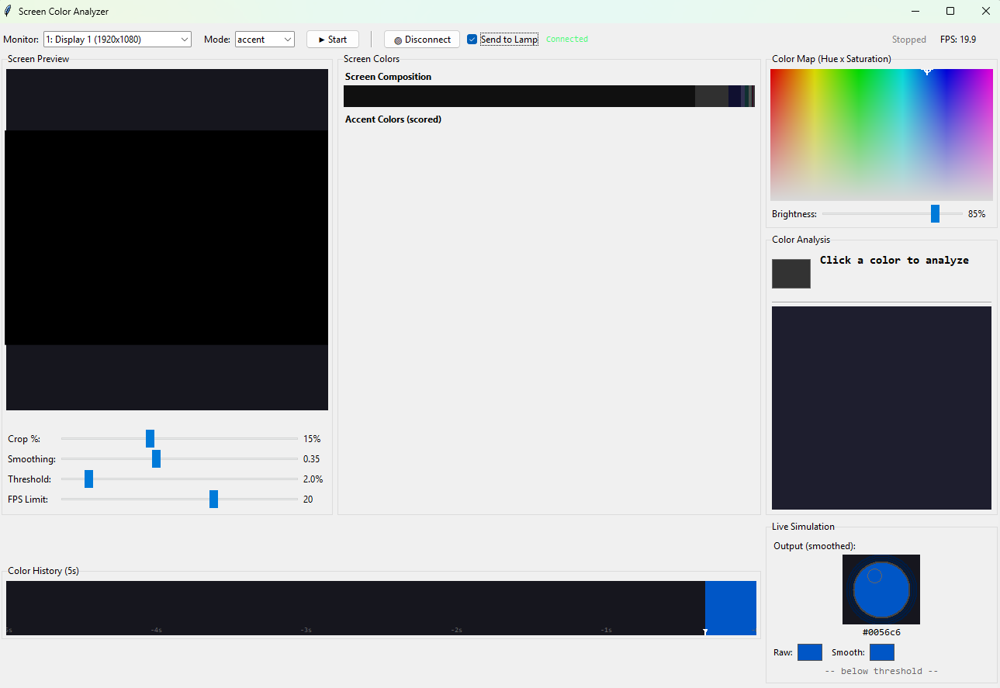

# Tuya Lamp Controller

Python application for controlling Tuya-based RGB smart lamps over the local network. Features a tkinter GUI, real-time screen color capture (ambilight), visual effects, music synchronization, and a REST API for external control. Includes a companion Android app.



## Features

- **Device Control** — Power, brightness, color temperature via Tuya protocol v3.5
- **RGB Color Picker** — Full color selection with live preview
- **Ambilight / Screen Capture** — Mirrors dominant screen colors to the lamp in real-time with adaptive smoothing
- **Visual Effects** — Rainbow, strobe, blinker with adjustable speed
- **Music Sync** — Audio-reactive lighting (RMS, beat detection, frequency bands)
- **REST API** — HTTP server on port 8765 for external control (no dependencies beyond stdlib)
- **Android App** — Kotlin/Jetpack Compose companion app via Retrofit

## Quick Start

```bash
# Install dependencies
pip install -r requirements.txt

# Run the main GUI
python smart_lamp_controller/main.py

# Or run the standalone controller
python improved_lamp_controller.py

# Run the screen color analyzer
python screen_color_analyzer.py
```

### First-time setup

1. Get your device's **ID**, **IP address**, and **local key** from the Tuya app or cloud API
2. Run `python smart_lamp_controller/scripts/pair_lamp.py` to pair, or create `lamp_config.json` manually:

```json
{
  "device": {
    "name": "My Lamp",
    "id": "your_device_id",
    "address": "192.168.1.100",
    "local_key": "your_local_key",
    "version": "3.5"
  }
}
```

## Project Structure

```
├── screen_color_analyzer.py        # Standalone ambilight tuning tool (screenshot above)
├── improved_lamp_controller.py     # Standalone GUI controller
├── smart_lamp_controller/          # Main organized package
│   ├── main.py                     #   Entry point
│   ├── core/
│   │   ├── device_manager.py       #   Thread-safe Tuya communication (command queue + conflation)
│   │   ├── effects_engine.py       #   Effect lifecycle management
│   │   ├── effects/                #   Rainbow, strobe, blinker (BaseEffect template pattern)
│   │   ├── ambilight_processor.py  #   Screen capture with color change detection
│   │   ├── smart_ambient_processor.py  #   Intelligent color scoring
│   │   └── audio_processor.py      #   RMS, beat detection, frequency analysis
│   ├── src/
│   │   ├── improved_lamp_controller.py  #   Main tkinter GUI
│   │   ├── tabs/                   #   Modular UI tabs (color, effects, audio, ambilight)
│   │   └── api_server.py           #   REST API (stdlib http.server)
│   └── utils/
│       └── config.py               #   JSON config with dot-notation access
├── SmartLampApp/                   # Android companion app (Kotlin/Jetpack Compose)
└── requirements.txt
```

## Dependencies

| Package | Required | Purpose |
|---------|----------|---------|
| `tinytuya` | Yes | Tuya device communication |
| `numpy` | For ambilight/audio | Array processing |
| `Pillow` | For ambilight | Image processing |
| `mss` | For ambilight | Screen capture |
| `opencv-python` | Optional | Faster color processing |
| `pyaudio` | For music sync | Audio input |
| `scipy` | For music sync | Frequency analysis |

The app degrades gracefully — audio and ambilight features are simply disabled when their dependencies are missing.

## REST API

Runs on port **8765**. All endpoints are POST except status.

| Method | Endpoint | Body |
|--------|----------|------|
| `GET` | `/status` | — |
| `POST` | `/power` | `{"state": "on"}` |
| `POST` | `/color` | `{"r": 255, "g": 0, "b": 128}` |
| `POST` | `/brightness` | `{"value": 500}` |
| `POST` | `/effect` | `{"name": "rainbow", "speed": 50}` |

## Android App

The `SmartLampApp/` directory contains a Kotlin/Jetpack Compose app that talks to the REST API. See [`SmartLampApp/README.md`](SmartLampApp/README.md) for build instructions.

## Running Tests

```bash
pytest smart_lamp_controller/tests/ -v
```

## License

This project is provided as-is for personal and educational use.
